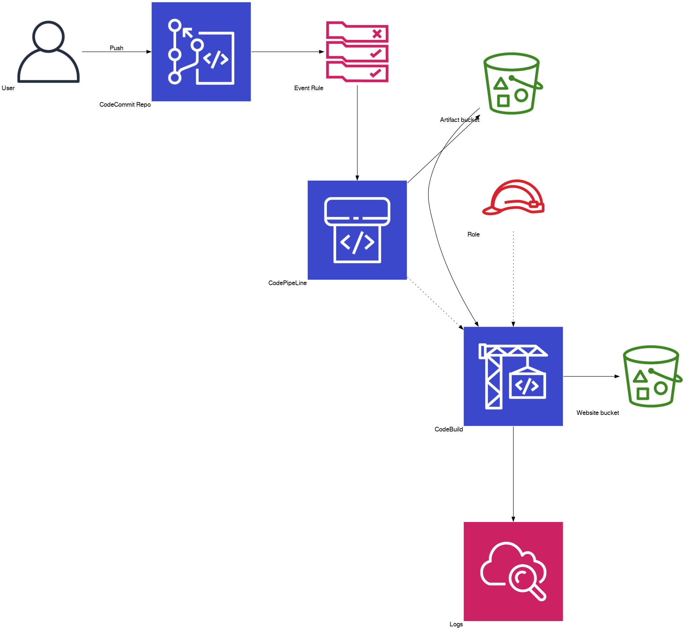

# CodePipeline With CDK

Implement CDK Hugo Website.

This CDK stack creates a CodePipeline which is triggered by an CodeCommit.

In the example a `buildspec.yml` for a gohuo static website deployment on a S3 bucket is included.

For a production website you would add an domain with R53 and a CloudFront CDN with https certificate.

All neccesary steps are included in a `Taskfile.yml`, which is interpreted by **task**. See [Task](https://taskfile.dev/#/) for installation details.

## Architecture overview



1. The user pushed updates to the repo
2. CodePipeline gets triggered by the EventRule
3. Input Artifacts are stored on S3
4. CodeBuils is triggered
5. CodeBuild installes hugo and renders site 
6. CodeBuild copies site (in '/public' ) to website bucket

## Short Installation

### Prequesites

1. install cdk
2. install task
3. clone this repository
4. create a working directory *outside* this repository. We call it `workdir`.
5. Copy `assets/Taskfile.yml` to `workdir`
6. Edit copied `Taskfile.yml`
    - Change line 8 to `CDK_DIR: workdir` 

### Deployment

1. `cd $workdir``
2. `task 1_Deploy_Pipeline`
3. `task 2_Create_Hugo`

### Examine deployed architecture

Look into the resources of the **CloudFormation Stack**.

You see the **CodeCommit** repository. Examine the Hugo Code.
You see the website bucket (Output `CodepipelineStack.websitebucketout` from the Stack)
Open the website bucket in a browser. You see the deployed static website.

Play around, create new Hugo posts and push them to the **CodeCommit** repo.
The website will be updated automatically.

### Cleanup

1. `task CodepipelineStack.websitebucketout
2. Delete websitebucket (order buckets with "Date Created", you will the the two buckets)
3. Delete gohugoartifactsbucket

## Detailes setup

## Deploy stack

```bash
cdk deploy
``` 

### Output

```bash
Outputs:
CodepipelineStack.websitebucketout = codepipelinestack-websitebucket976268b6-90738bunw6s6
CodepipelineStack.repocloneurl = https://git-codecommit.eu-central-1.amazonaws.com/v1/repos/myhugorepositoryname
```

## Create hugo site

Choose a working directory and install hugo as described here: [Quick Start \| Hugo](https://gohugo.io/getting-started/quick-start/)


```bash
hugo new site quickstart
cd quickstart
```

## Add git

Initialize git and add `CodepipelineStack.repocloneurl`as remote.

```bash
git init
git submodule add https://github.com/xaprb/story.git themes/story
git remote add origin https://git-codecommit.eu-central-1.amazonaws.com/v1/repos/myhugorepositoryname
```

## Define buildspec

Copy the `buildspec.yml` from the `assets/buildspec.yml` to the `quickstart`directory..


## Add theme and content

```bash
echo 'theme = "story"' >> config.toml
hugo new posts/my-first-post.md
echo public >>.gitignore
```

## Commit files


```bash
git add .
git commit -m "Quickstart initial"
git push --set-upstream origin master
```

For this to work you have to have a valid AWS profile running and the credential helper installed:
[Setup Steps for HTTPS Connections to AWS CodeCommit Repositories on Linux, macOS, or Unix with the AWS CLI Credential Helper - AWS CodeCommit](https://docs.aws.amazon.com/codecommit/latest/userguide/setting-up-https-unixes.html)

## Monitor pipeline

Goto the AWS Console to CodeBuild and monitor the deployment pipeline.

### Pipeline view


## Add Content and push

With each push you pipeline will be executed and the generated files will be copied to the websitebucket.

```bash
git add .
git commit -m "Some meaningfull message"
git push
```

## Destroy

Websitebucket is not deleted!
Because its rendered with

```yaml
    DeletionPolicy: Retain
```
