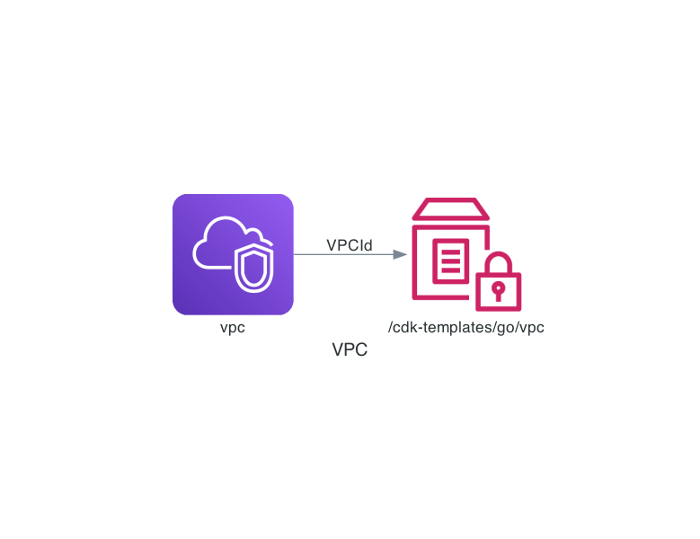

# VPC - getting started example for go

The VPCid is stored in a SSM parameter for the integration tests.



## Integration Test with terratest

Fetch the vpc id from ssm.

```go
vpcId := awstest.GetParameter(t,region,"/cdk-templates/go/vpc")
awstest.GetVpcById(t, vpcId,region)
```    

## Integration Test with cit

Get GO SDK vpc type with stack and construct name:

```go
vpc,err := ec2.GetVpc(aws.String("VpcStack"), aws.String("MyVpc"))
```