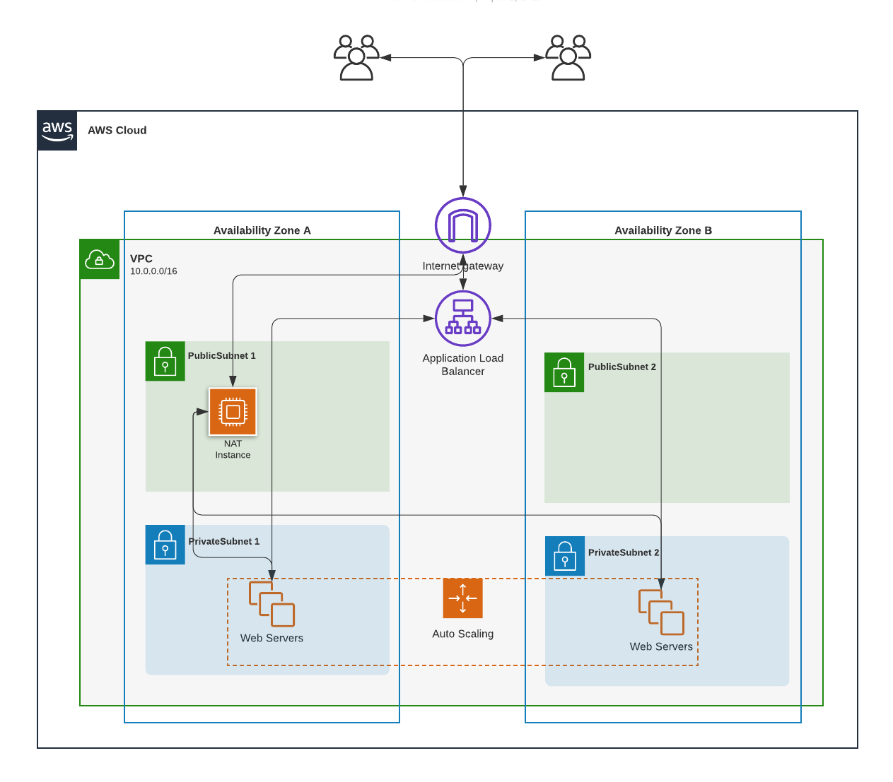

# VPC - ALB - ASG

> This code is build in dependence on Gernot's [cdk-template](https://github.com/tecracer/cdk-templates/tree/master/alb-update). Ckeck it out if you prefer a similar implementation in Typescript. 

## Introduction

This CDK app sets up a classic 2 tier infrastructure consisting of an Application Load Balancer and an AutoScaling Group. It should demonstrate the handling of these AWS Service with CDK and how they get connected. Furthermore it shows some small customization to the CDK default setup.

## Architecture

This stack builds up a bunch of things:

- A VPC with Subnets (2 public, 2 private)
- A NAT-Instance
- An Application Load Balancer
- An AutoScaling Group
- Min. 2 Worker-Instances with WebServer installed

## Prerequisites

- Python >= 3.6 is installed
- CDK is installed --> ([Installing the AWS CDK](https://docs.aws.amazon.com/cdk/latest/guide/getting_started.html))

## Steps to deploy

1. Clone or checkout repo/branch (git clone / git checkout)
2. Navigate to this directory (\<yourDir\>/cdk-templates/python-alb-asg)
3. Create a new python virtual environment, e.g. `python3 -m venv .env`
4. Activate the environment using `source .env/bin/activate` on Mac or Linux or run `source.bat` on Windows.
5. Install dependencies: `pip install -r requirements.txt`
6. Set your Environment as described here: [CDK Environment](https://docs.aws.amazon.com/cdk/latest/guide/environments.html)
6. Run `cdk synth` to check if the CDK works as expected, you can inspect the template if you're curious.
7. Run `cdk deploy` to deploy the resources. 

## Useful CDK commands

 * `cdk ls`          list all stacks in the app
 * `cdk synth`       emits the synthesized CloudFormation template
 * `cdk deploy`      deploy this stack to your default AWS account/region
 * `cdk diff`        compare deployed stack with current state
 * `cdk docs`        open CDK documentation

