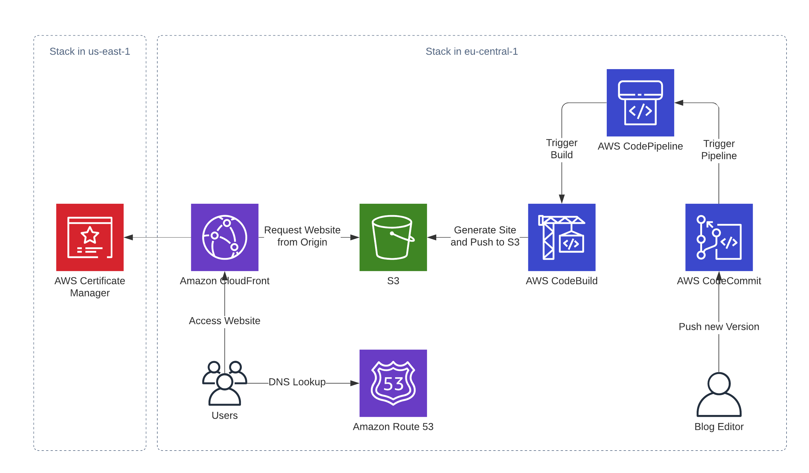

# Static Website with a build pipeline

> This is code has an accompanying [blog article TODO](https://aws-blog.de/2020/03/building-a-fargate-based-container-app-with-cognito-authentication.html) which I highly recommend you check out before deploying it.

## Introduction

This CDK app sets up the infrastructure for a static website built with Hugo and distributed by CloudFront. It includes the whole serverless pipeline to build and deploy new versions of the website.

## Architecture



This stack builds up a bunch of things:

- An S3 Bucket that hosts the website
- A CloudFront distribution with the above mentioned bucket as its origin
- A CodeCommit repository to store the source of the website
- A Code Pipeline including CodeBuild to automatically build new versions of the website

## Prerequisites

- CDK is installed
- git is installed
- Python >= 3.6 is installed
- You have a public hosted zone in your account

## Steps to deploy

These steps look a little convoluted - what we're essentially doing is copy the code to a working directory and initialize git there in order for us to be able to push the code and website to our Repository.

1. Check out the repo and copy everything in the `python-static-website-with-build-pipeline` directory.
1. Create yourself a new working directory outside of this repository - this is where you'll initialize your website. I'll refer to this as `$WorkDir`
1. Paste the contents in `$WorkDir`, you should now have all of the resources from the original repository in your working directory.
1. Create a new python virtual environment, e.g. `python3 -m venv .env`
1. Activate the environment using `source .env/bin/activate` on Mac or Linux or run `source.bat` on Windows.
1. Install all dependencies for python with `pip install -r requirements.txt`
1. Open `python-static-website-with-hugo-codepipeline-and-cloudfron/app.py` and edit these variables as described in the [blog article TODO](https://aws-blog.de/2020/03/building-a-fargate-based-container-app-with-cognito-authentication.html):

    ```python
    WEBSITE_DOMAIN_NAME = "blog.mb-trc.de"
    HOSTED_ZONE_ID = "ZECQVEY17GSI4"
    HOSTED_ZONE_NAME = "mb-trc.de"
    ```

1. Run `cdk deploy certificate-stack` then look at the outputs and note the Certificate ARN.

    The Output should look something like this

    ```text
    Outputs:
    certificate-stack.CertificateArn = arn:aws:acm:us-east-1:123123212312:certificate/4d45bfb4-19f4-4dbd-8cd6-b510f4fdf8b4
    ```

1. Edit the `app.py` and insert the Certificate ARN from the previous step in the Variable `CLOUDFRONT_CERTIFICATE_ARN`.

1. Then run `cdk deploy static-website-stack` and note the output of the repo clone URL.
1. Now run `git init` to initialize an empty git repository in the current working directory
1. Run `git remote add origin <clone-url>` to link your local repository to the remote repo (if you're using CodeCommit for the first time I recommend a look at the [documentation for setting up authentication](https://docs.aws.amazon.com/codecommit/latest/userguide/setting-up.html])).
1. Run `git add . && git commit -m "Initial Commit"` to commit all of your changes to the local repository.
1. Run `git push --set-upstream origin master` to push your local repository to CodeCommit (for subsequent pushes `git push` is sufficient)
1. If you look in AWS you should see CodePipeline build and deploy your code and after 1-2 minutes the website should be available at the domain you configured.

### Running your own website

This repo includes just a sample site with nothing on it.
To use your own hugo website you need to do the following things:

1. Remove the content of `website/`
2. Add your website in `website/`
3. Edit the `buildspec.yml` at the same level as this readme file and change the line after the `#TODO` comment to download your specific theme

    ```yaml
        # TODO: Add your own theme here!
        - git submodule add https://github.com/budparr/gohugo-theme-ananke.git themes/ananke
    ```

4. Run `git add`, `git commit` and `git push` to tell the pipeline to deploy your new website.
