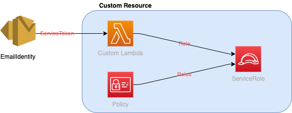

# AWS Custom Resource

Example of creating a resource type which is not supported Cloudformation.

Please change email address in `lib/aws-custom-resource-ses-stack.ts` to an adress you own before deploy.

An SES EmailIdentiy is created with an CDK AwsCustomResource.
This custom resource is backed by lambda.